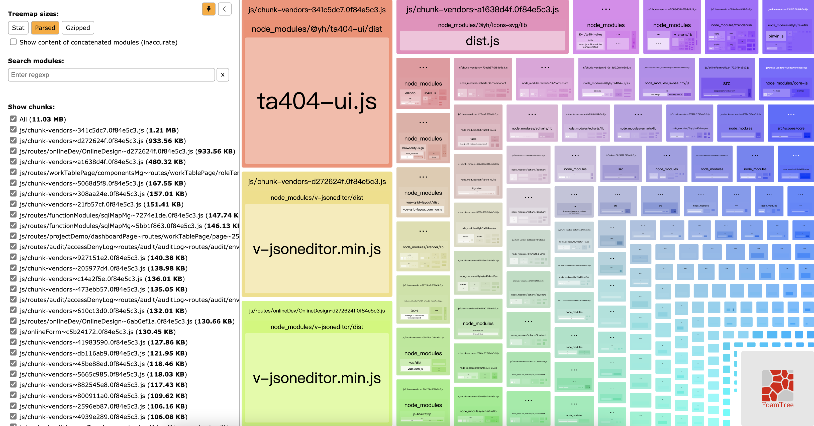
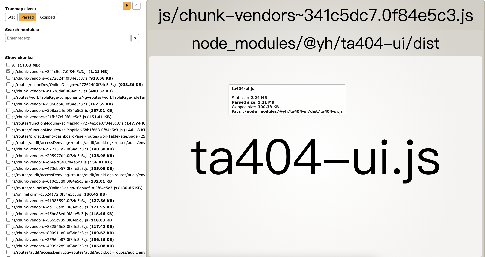
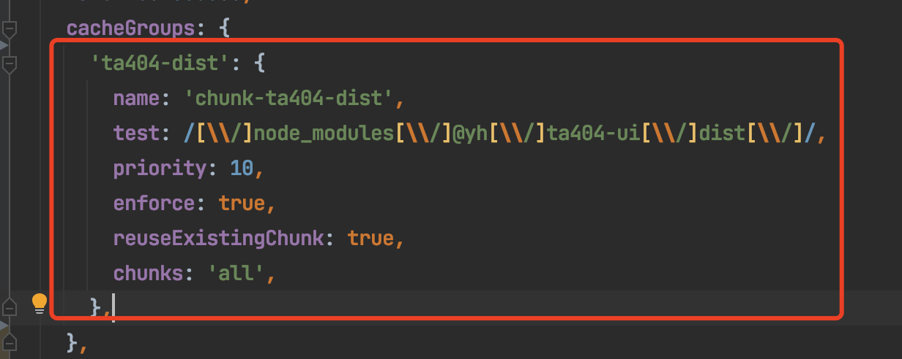
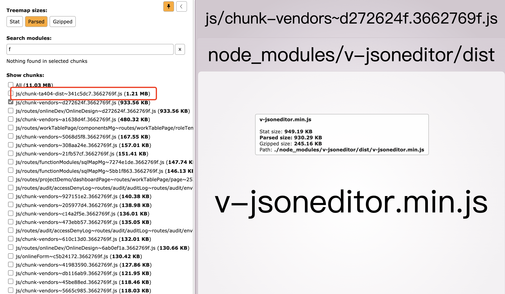

# CacheGroups配置

## 拆分原理

###  bundle chunk module 区别

- 一般来说,module代表一个npm模块或一个源代码文件.
- 一个chunk可能会包含一个或多个module
- 一个bundle即最终生成的一个js文件,即:一个bundle最终对应一个chunk

**结论**

CacheGroups配置拆分,即从chunk中拆分出一个一个的module,并将拆分出的module放入一个新的chunk中

## 配置方式

### 步骤

1. 将`splitChunks.cacheGroups`的配置留空或保留默认配置
1. 执行命令 `npm run build --report`
1. 等待执行完成后,在浏览器中打开`dist/report.html`,此时可见如下的界面
   
   页面分为两个部分,左侧为生成的`chunks`文件的目录,右侧为`chunks`文件中包含的`modules`
1. 在左侧取消勾选所有`chunks`,然后在下面选择单独的某个`chunks`,如图
   
   此时可以看到,这个`chunk`中包含`@yh/ta404-ui/dist/ta404-ui.js`这个`module`
1. 然后,配置`splitChunks.cacheGroups`,将下面的配置代码写入其中.
   ```javascript
   'ta404-dist': {
           name: 'chunk-ta404-dist',
           test: /[\\/]node_modules[\\/]@yh[\\/]ta404-ui[\\/]dist[\\/]/,
           priority: 10,
           enforce: true,
           reuseExistingChunk: true,
           chunks: 'all',
         },
   ```

1. 再次执行2,3,4三步,可以看到此时,`chunk-vendors`中不再包含`@yh/ta404-ui/dist/ta404-ui.js`这个`module`,而左侧的`chunks`文件中增加了一个名为`ta404-dist`的`chunk`

   此时,拆分`@yh/ta404-ui/dist/ta404-ui.js`成功,重复4,5,6步骤即可继续拆分其他`module`

